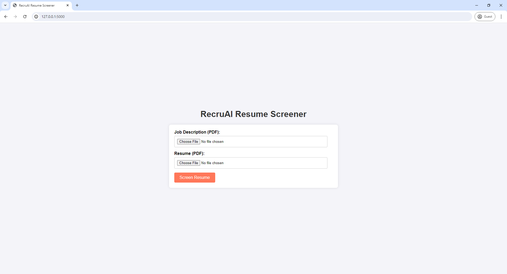
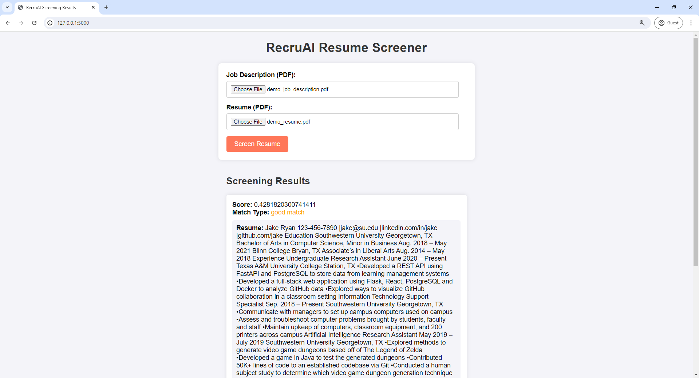

# RecruAI

RecruAI is an intelligent resume screening web application that uses Cohere's embeddings model to match job descriptions with candidate resumes, identifying the best fits based on skills and experiences. The application is built with Flask and the Cohere API.

## Features

- Upload job descriptions and resumes in PDF format
- Extract text from PDF files
- Use text embeddings to calculate similarity between job descriptions and resumes
- Display match results with scores and match types

## Screenshots

### Home Page



### Results Page



## Getting Started

To get a local copy up and running, follow these steps.

### Prerequisites

- Python 3.x
- Cohere API Key

### Installation

1. Clone the repository:

   ```bash
   git clone https://github.com/stefan-smol/recruai.git
   cd recruai
   ```

2. Set up a virtual environment and activate it:

   ```bash
   python -m venv venv
   source venv/bin/activate  # On Windows, use `venv\Scripts\activate`
   ```

3. Install the required dependencies:

   ```bash
   pip install -r requirements.txt
   ```

4. Create a `.env` file in the root directory and add your Cohere API key:

   ```makefile
   COHERE_API_KEY=your_cohere_api_key
   ```

5. Start the development server:

   ```bash
   flask run
   ```

## Usage

1. Open your web browser and navigate to `http://127.0.0.1:5000/`.
2. Upload a job description and a resume in PDF format.
3. Click "Screen Resume" to see the results.
